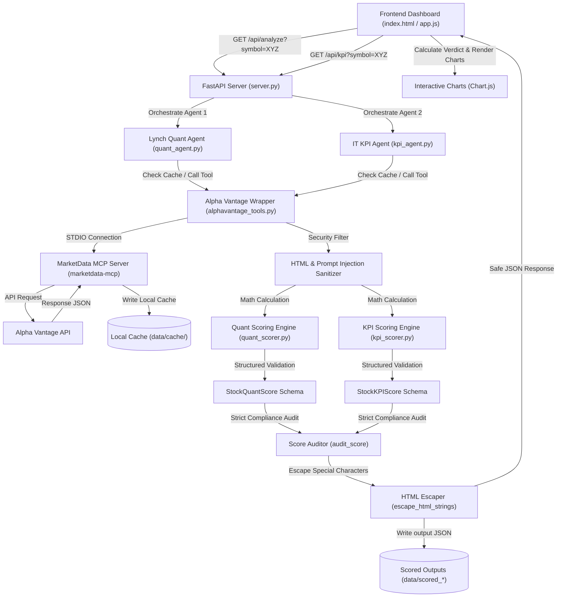

# Project Technical Documentation: Peter Lynch Stock Analyser

This document outlines the architecture, data pipeline, individual agent workflows, and business scoring logic for the Peter Lynch Stock Research Analyser.

> [!WARNING]
> **Disclaimer**: This documentation describes a Proof of Concept (POC) system developed for educational and demonstration purposes. It does not provide real investment recommendations. The stock list is static, and qualitative features are planned for future iterations.

---

## 1. System Architecture & Data Flow

The system is designed as a modular multi-agent pipeline orchestrated via FastAPI, utilizing the **Google Agent Development Kit (ADK)** for agent reasoning, **Model Context Protocol (MCP)** for API-agnostic tool calls, and local JSON caching for offline capability.

### Data Flow Diagram

---

## 2. Agent Workflows

The system leverages three separate logical agents:

### Agent 1: Lynch Quantitative Analyser (`lynch_quant_agent`)
* **Role**: Evaluates the stock's fundamental valuation and balance sheet metrics.
* **Model**: `gemini-2.0-flash`
* **Workflow**:
  1. Triggered with a stock symbol (e.g. `AAPL`).
  2. Calls the primary analysis tool `perform_lynch_analysis(symbol)` which aggregates data from six distinct financial endpoints.
  3. Executes mathematical calculations in the scoring engine (`quant_scorer.py`).
  4. Returns a validated `StockQuantScore` JSON object containing PE, PEG, D/E, Revenue Growth CAGR, Net Cash %, FCF Conversion, and scores for each out of 60 total points.

### Agent 2: IT Sector KPI Analyser (`it_kpi_agent`)
* **Role**: Assesses operational excellence and industry-specific indicators for the stock.
* **Model**: `gemini-2.0-flash`
* **Workflow**:
  1. Triggered with a stock symbol.
  2. Calls the KPI tool `perform_kpi_analysis(symbol)` to pull quarterly statements, analyst ratings, and EPS forecasts.
  3. Evaluates trend patterns (e.g. margin expansion/contraction, revenue growth acceleration, consensus strength, ROE quality).
  4. Returns a validated `StockKPIScore` JSON object scoring metrics out of 40 total points.

### Agent 3: Ranking Engine & Report Generator (`report_agent`)
* **Role**: Integrates individual agent scores, computes composite results, and compiles the final leaderboard.
* **Orchestration**: Managed in `server.py` via `/api/rankings` and compiled dynamically.
* **Workflow**:
  1. Reads `data/scored_quant.json` and `data/scored_kpi.json`.
  2. Pairs corresponding records for each ticker.
  3. Calculates the composite score: `Composite Lynch Score = Quant Score (60) + KPI Score (40) = 100 points`.
  4. Computes investment verdicts based on the composite score and serves it to the frontend dashboard.

---

## 3. Business Logic & Rubrics

The evaluation logic applies Peter Lynch's stock screening heuristics divided into quantitative criteria (60%) and industry quality metrics (40%).

### Quantitative Rubric (Max 60 points)

1. **PEG Ratio (Max 15 pts)**: Measures valuation relative to growth rate.
   * `PEG <= 0.5`: **15 pts**
   * `0.5 < PEG <= 1.0`: **12 pts**
   * `1.0 < PEG <= 1.5`: **8 pts**
   * `1.5 < PEG <= 2.0`: **4 pts**
   * `PEG > 2.0`: **0 pts**

2. **Debt to Equity (Max 12 pts)**: Measures leverage safety.
   * `D/E < 0.3`: **12 pts**
   * `0.3 <= D/E <= 0.5`: **9 pts**
   * `0.5 < D/E <= 0.8`: **5 pts**
   * `D/E > 0.8`: **0 pts**

3. **5-Year Revenue CAGR (Max 12 pts)**: Measures historical growth momentum.
   * `CAGR > 20%`: **12 pts**
   * `15% <= CAGR <= 20%`: **9 pts**
   * `10% <= CAGR < 15%`: **6 pts**
   * `5% <= CAGR < 10%`: **3 pts**
   * `CAGR < 5%`: **0 pts**

4. **P/E vs. 5-Year Historical Median (Max 10 pts)**: Evaluates current PE relative to historical norms.
   * `Ratio < 0.85`: **10 pts**
   * `0.85 <= Ratio <= 1.0`: **8 pts**
   * `1.0 < Ratio <= 1.15`: **5 pts**
   * `1.15 < Ratio <= 1.3`: **2 pts**
   * `Ratio > 1.3`: **0 pts**

5. **Net Cash % of Market Cap (Max 6 pts)**: Rewards net cash balances.
   * `Net Cash % > 20%`: **6 pts**
   * `10% <= Net Cash % <= 20%`: **4 pts**
   * `0% < Net Cash % < 10%`: **2 pts**
   * `Net Debt (Cash <= Debt)`: **0 pts**

6. **Free Cash Flow (FCF) Conversion (Max 5 pts)**: Measures earnings quality (`Operating Cash Flow / Net profit`).
   * `FCF Conversion > 85%`: **5 pts**
   * `70% <= FCF Conversion <= 85%`: **4 pts**
   * `55% <= FCF Conversion < 70%`: **2 pts**
   * `FCF Conversion < 55%`: **0 pts**

### IT KPI Rubric (Max 40 points)

1. **EBIT Margin Trend (Max 12 pts)**: Evaluates operating efficiency over 4 quarters.
   * `Expanding (>150bps increase QoQ)`: **12 pts**
   * `Stable (Within +/- 150bps)`: **8 pts**
   * `Declining (<150bps decrease)`: **4 pts**

2. **Revenue Growth Trend (Max 10 pts)**: Detects top-line demand acceleration.
   * `Accelerating (Positive momentum over 2+ quarters)`: **10 pts**
   * `Stable (Flat/steady growth)`: **6 pts**
   * `Decelerating (1 quarter of slowdown)`: **3 pts**
   * `Decelerating (2+ quarters of slowdown)`: **0 pts**

3. **Analyst Consensus Rating (Max 8 pts)**: Reflects institutional sentiment (`Buy/StrongBuy %`).
   * `Buy % >= 70%`: **8 pts**
   * `50% <= Buy % < 70%`: **6 pts**
   * `30% <= Buy % < 50%`: **3 pts**
   * `Buy % < 30%`: **0 pts**

4. **Return on Equity (ROE) Trend (Max 6 pts)**: Capital deployment efficiency over 3 years.
   * `ROE > 20% & Improving`: **6 pts**
   * `ROE > 20% & Stable`: **4 pts**
   * `15% <= ROE <= 20%`: **2 pts**
   * `ROE < 15%`: **0 pts**

5. **EPS Estimate Revision (Max 4 pts)**: Earnings momentum direction.
   * `Upward Revision`: **4 pts**
   * `No Change`: **2 pts**
   * `Downward Revision`: **0 pts**

---

## 4. Investment Verdicts

The final composite score determines the stock's recommendation:

| Score Range | Verdict | Description |
|---|---|---|
| **80 - 100** | **STRONG BUY** | Exceptional alignment with Lynch principles, high growth, and clean financials. |
| **65 - 79** | **BUY** | Solid fundamentals with acceptable margins of safety and stable cash flow. |
| **50 - 64** | **WATCH** | Good business but currently trading at a premium valuation or minor margin pressure. |
| **35 - 49** | **NEUTRAL** | Does not meet Peter Lynch's criteria for attractive investment candidate. |
| **0 - 34** | **AVOID** | Elevated debt, declining revenue, or overvalued PE multiples. |
